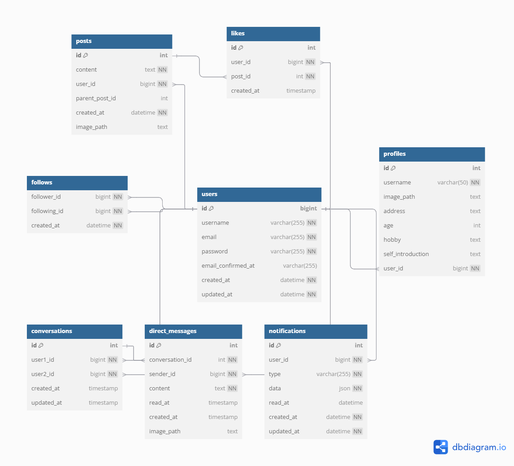

# Social Networking Service

このリポジトリは、PHPとJavaScriptで構築されたSNS（ソーシャルネットワーキングサービス）のバックエンドプロジェクトです。  
ユーザー認証、投稿、コメント、いいね、フォロー、ダイレクトメッセージなど、SNSに必要な基本機能を備えています。

## 主なディレクトリ構成

- `Controllers/` ... 各種リクエストの処理ロジック
- `Models/` ... エンティティやビジネスロジック
- `Views/` ... PHPベースのテンプレート（HTML）
- `Routing/` ... ルーティング定義（`routes.php`）
- `Validators/` ... バリデーションルール・クラス
- `public/` ... 公開ディレクトリ（JS, CSS, 画像など）
- `Database/` ... DAOやDB接続関連

## 主な機能

- ユーザー登録・ログイン・ログアウト
- 投稿（画像アップロード対応）
- コメント（リプライ）
- いいね
- フォロー・アンフォロー
- プロフィール編集・アイコン変更
- ダイレクトメッセージ
- 通知機能

## ER図

## セットアップ方法

1. 必要なPHP拡張・ライブラリをインストール
2. データベースを作成し、必要なテーブルを用意
3. `public/` ディレクトリをWebサーバのドキュメントルートに設定
4. `.env` などでDB接続情報を設定（必要に応じて）

## 開発・運用

- コードの追加・修正は各ディレクトリの責務に従って行ってください。
- バリデーションルールは `Validators/` 配下で管理しています。
- ルーティングは `Routing/routes.php` で定義されています。

## ライセンス

このプロジェクトはMITライセンスです。

---

## 補足

- 質問やバグ報告はIssueで受け付けています。
- コントリビューション歓迎です！
